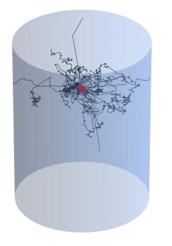

# NeutroWater

NeutroWater is a Monte Carlo simulation designed to explore neutron moderation within a water-filled tank, focusing on analyzing neutron flux and energy distribution.

The project started under the University of Amsterdam's physics lab, which has a neutron source generating $9.3×10^5$ neutrons per second with energies of $3-10$ MeV. It's a blend of americium-241 (11 GBq activity) and beryllium-9. These neutrons can be used to activate other materials: by capturing a neutron, the mass number of the atomic nuclei increases, creating other isotopes. 

The reason for this project is that we lacked data on neutron energy distribution and density in the tank, crucial for safety and activation efficiency.

 
 
 

## Documentation

The [complete documentation](https://derkniessink.github.io/NeutroWater/) of NeutroWater is hosted on Read the Docs.

 

## Instalation

[Instalation instructions](https://derkniessink.github.io/NeutroWater/user_guide/) can be found under User Guide in the documentation.
