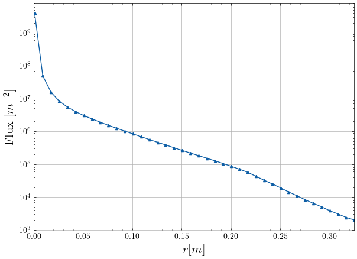
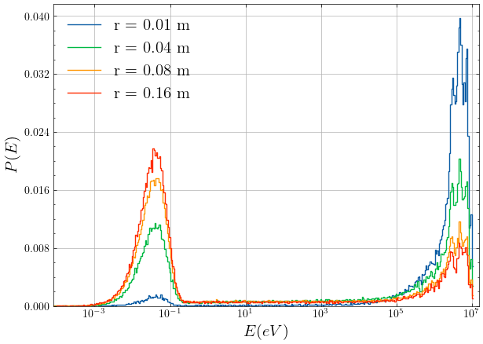
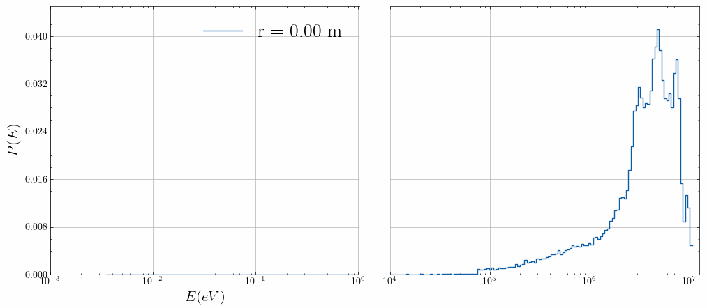
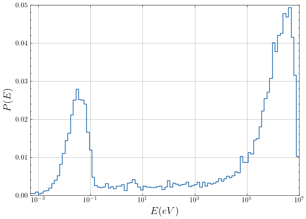

# Results

Understanding the energy distribution and number density of neutrons within the tank is important for the following two reasons:

1. <b> Activation Efficiency </b>: The effectiveness of the activation process depends on the energy of the neutrons. Relevant results are presented in sections [Flux](#1-flux) and [Energy Spectrum](#2-energy-spectrum).

2. <b> Safety Assurance </b>: Neutron energies at the tank boundary need to be low enough to ensure safe release into the environment. Findings related to this aspect are discussed in section [Escaping Neutrons](#3-escaping-neutrons).

Simulations involving 50000 neutrons were conducted to produce the results. Note that the neutron source emits approximately $8 \times 10^5$ neutrons per second. If applicable, the obtained result can be adjusted accordingly based on this emmision rate by transformation, or alternativaly, simulations utilizing the emmission rate as the number of neutrons could be conducted. The parameters used for the simulation are shown below:

``` 
from neutrowater import diffusing_neutrons as dn

params = dn.Parameters(
            nNeutrons=50000, 
            radius_tank=0.225, 
            height_tank=0.85, 
            position_tank=(0, 0, -0.175)
            )
``` 

More information on how to reproduce these results is discussed in the [User Guide](user_guide.md#user-guide).

## 1 Flux

The flux as a function of distance from the origin was calculated using the methodology outlined in section [Flux](./theory.md#61-flux) and is shown in Figure 14.  


<center>
<figure markdown="span">
  { width="450" }
  <figcaption><i>Figure 14: Flux [number of neutrons per meter square] as a function of distance from the origin [meters]. </i></figcaption>
</figure>
</center>

## 2 Energy Spectrum

The energy spectrum is shown as a probability density graph for varying distances from the origin in Figure 15 and was measured following the methodology in [Energy Spectrum](./theory.md#62-energy-spectrum).

<center>
<figure markdown="span">
  { width="550" }
  <figcaption><i>Figure 15: Probability density graph of energies at varying distances r from the origin. </i></figcaption>
</figure>
</center>

For neutron activation, we are mainly interested in the high-energy neutrons (right peak). In Figure 16, a movie of the energy spectrum is shown for varying distance $r$ from the origin, where a cut was made to highlight the thermal and high energy peak. 

<center>
<figure markdown="span">
  { width="1000" }
  <figcaption><i>Figure 16: Movie of the probability density graph of energies for varying distances r from the origin. A cut was made to highlight the thermal and high energy peak. </i></figcaption>
</figure>
</center>

The energy spectrum and the [result for the flux](#1-flux) can be combined to find the number of neutrons that have a specific energy.

## 3 Escaping Neutrons

In the simulation $17.24 \%$ of the neutrons escape from the tank and the rest is absorbed. The energy spectrum of the escaping neutrons in shown in Figure 17.

<center>
<figure markdown="span">
  { width="450" }
  <figcaption><i>Figure 17: Probability density graph of energies of the escaping neutrons. </i></figcaption>
</figure>
</center>

We can use the energy spectrum of the escaping neutrons along with the [result for the flux](#1-flux) to approximate the number of high-energy neutrons that escape from the tank.