# Theory and Methodology

## 1. General Program Flow

The software conducts a collision-driven Monte Carlo simulation, where it simulates each particle individually. Prior to running the simulation, it must undergo initialization, which involves the following steps:

* Interpolating the total, absorbtion, and scattering cross section data.
* Interpolating data of the initial energy distribution of the neutrons.
* Sampling the initial neutron energies from the energy distribution.
* Setting the initial position and energies of the neutrons.
* Setting the position and size of the tank.

The initial spectrum is discussed in [Initial Energy Spectrum](./theory.md#21-initial-energy-spectrum), the method of sampling from a distribution is described in [Monte Carlo Sampling](#4-monte-carlo-sampling), and the interpolation of distributions in [Interpolation](#5-interpolation). After the initializing, the actual simulation of the diffusing neutrons can start. Each neutron's energy and position is updated consecutively which consists of the following steps:

1. Give the neutron a random direction.
2. Check if the neutron is inside the tank, if false end the loop else continue.
3. Get the total cross section corresponding to the current energy of the neutron. 
4. Determine the nuclide with which the neutron collides.
5. Check if the the neutron has a thermal energy.
6. Compute the mean free path of the neutron and sample the distance to the next collision.
7. Determine the type of reaction. If it is absorption, end the loop; if it is elastic scattering, proceed.
8. Sample a direction from the angular distribution and compute the associated energy loss fraction. 
9. Update the Neutron's position and energy.
10. Repeat steps 2-9 until the neutron either escaped or is absorbed.

Each step is discussed in more detail in the following sections:

| Steps       | Section                                                                 |
| ----------- | -----------                                                             |
| 2           | [Geometry](#3-geometry)                                      |
| 3-4         | [Cross Sections](#22-cross-sections)                         |
| 5           | [Thermal Motion](./theory.md#26-thermal-motion)                         |
| 6           | [Distance To Next Collision](#23-distance-to-next-collision) |
| 7           | [Neutron Interactions](#24-neutron-interactions)             |
| 8-9         | [Handling Scattering Interaction](./theory.md#25-handling-scattering-interaction)     |

In the simulation, positions and energies of the neutrons are stored. Several properties can be computed and measured from this data post-simulation. The procedure of measuring these properties is described in [Measuring Quantities](#6-measuring-quantities).

## 2. Neutron Physics

### 2.1 Initial Energy Spectrum

The neutron source used is a mixture of americium-241 and beryllium-9. The following reactions take place in the source:

\begin{equation} ^{241}_{95}\text{Am} \ \rightarrow \ ^{237}_{93}\text{Np} \ + \ ^4_2\text{He}, \end{equation}

\begin{equation} ^4_2\text{He} \ + \ ^9_4\text{Be} \ \rightarrow \ ^{12}_6\text{C} \ + \ ^1_0\text{n}. \end{equation}

The first reaction involves the \( \alpha- \) decay of the americium. The \( \alpha \) particles have a probability of about \( 10^{-4}\) to undergo fusion with the berylium, described by the second reaction. This reaction leads to the emmission of neutrons with energies between 3 and 10 MeV. We use the Am-Be energy spectrum (Figure 1) from the [ISO 8529-1](https://www.iso.org/standard/80060.html) standard for sampling the initial energies of the neutrons.

<figure markdown="span">
  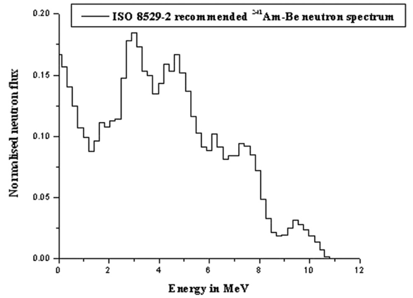{ width="400" }
  <figcaption><i>Figure 1: ISO neutron spectrum for Am-Be.</i></figcaption>
</figure>

The neutron spectrum is interpolated to serve as a probability distribution of energies \( P(\text{Energy}) \). This interpolation and subsequent sampling follow the methodology described in [Interpolation](#5-interpolation) and [Monte Carlo Sampling](#4-monte-carlo-sampling) respectively. The interpolated initial neutron energy spectrum from the Am-Be source is shown in Figure 2.

<figure markdown="span">
  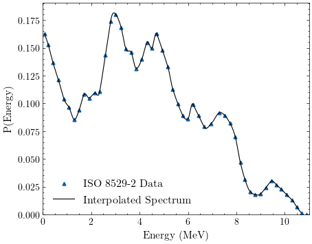{ width="400" }
  <figcaption><i>Figure 2: Interpolated ISO neutron spectrum for Am-Be.</i></figcaption>
</figure>

 

### 2.2 Cross Sections

The cross section indicates the likelihood of a particular interaction occurring between two particles. It is influenced by two main factors: the types of particles involved and their energies. In our scenario, there are two possible combinations of particles in an interaction: a neutron with an H-nucleus and a neutron with an O-nucleus. Unfortunately, it's not possible to calculate the cross section as a function of energy analytically. However, there is an abundance of freely accessible nuclear data available to everyone. In the program, cross section data from [ENDF/B](https://www.nndc.bnl.gov/endf-b8.0/) is used an interpolated following the procedure outlined in [Interpolation](#5-interpolation).

In various reactions, different cross sections are involved. To proceed, we employ the following notations:

| Notation                                                          | Description                                                |   
| --------                                                          | --------                                                   |
| \(\sigma_{H, tot}, \sigma_{O, tot}\)                              | Total cross section for the specified nuclide.             |
| \(\sigma_{H, s}, \sigma_{O, s}\)                                  | Scattering cross section for the specified nuclide.        |
| \(\sigma_{H, a}, \sigma_{O, a}\)                                  | Absorption cross section for the specified nuclide.        |
| \(\Sigma_{H_2O}, \Sigma_{H}, \Sigma_{O}\)                         | Total macroscopic for the specified nuclide or molecule.   |      

The theory behind these reactions is described in detail in [Neutron Interactions](#24-neutron-interactions). For each type of cross section and nuclide there are separate datafiles. Total macroscopic cross section for a molecule can be computed as follows:

\begin{equation} \Sigma = \sum_i N_i \sigma_i, \end{equation}

where \(N_i\) is the atomic density of atoms of type \(i\):

\begin{equation} N_i = \frac{\rho N_a}{M} n_i, \end{equation}

where \(\rho\) is the density of the compound, \(M\) the molecular weight, \(N_a\) Avogrado's constant, and \(n_i\) the number of atoms of type \(i\) in the molecule. Thus, the total macrocscopic cross section for \(H_2O\) is given by:

\begin{equation} \Sigma_{H_2O} = \frac{\rho_{H_20} N_a}{M_{H_20}} (2 \sigma_{H, t} + \sigma_{O, t}). \end{equation}

The cross sections in barns (\(10^{-28} m^2\)) as a function of neutron energy for the O and H nuclide are shown in Figure 3 and 4.

<figure markdown="span">
  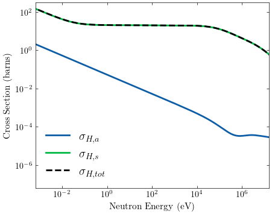{ width="400" }
  <figcaption><i>Figure 3: Hydrogen cross sections in barns at temperature T=300K.</i></figcaption>
</figure>

<figure markdown="span">
  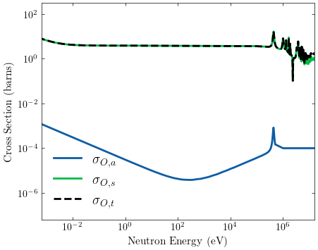{ width="400" }
  <figcaption><i>Figure 4: Oxygen cross sections in barns at temperature T=300K.</i></figcaption>
</figure>

### 2.3 Distance to Next Collision

The distance to the next collision \(l\) follows a distribution function given by:

\begin{equation} p(l)dl=\Sigma e^{-\Sigma l}dl, \end{equation}

where \(\Sigma\) is the total macroscopic cross section of an arbitrary material. Integrating both sides to some distance \(l\) gives:

\begin{equation} \int_0^l dl'p(l') = 1 - e^{\Sigma l}. \end{equation}

As the probability distribution is normalized, we can set the this cummulative distribution to a uniformly distributed random 
number \(\xi\) on the interval \( [0, 1) \). Isolating \(l \) and using that in this case \(\Sigma \equiv \Sigma_{H_2O} \), gives us a formula for sampling the distance to the next collision:

\begin{equation} l = - \lambda \ln{\xi}, \end{equation}

where \(\lambda \) is the mean-free-path which is given by

\begin{equation} \lambda = 1 / \Sigma_{H_2O}. \end{equation}

The mean-free-path as a function of neutron energy is shown in Figure 5.

<figure markdown="span">
  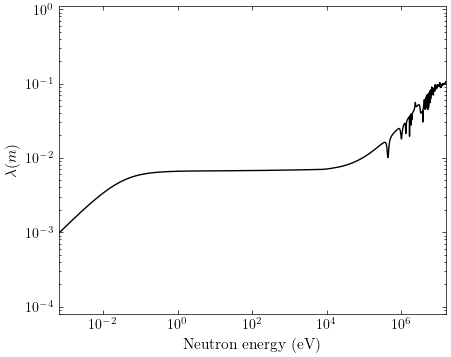{ width="400" }
  <figcaption><i>Figure 5: Mean-free-path in water as a function of neutron energy. </i></figcaption>
</figure>

### 2.4 Neutron Interactions

To determine the type of reaction involving a nuclide, we initially identify which type of nuclide the neutron interacts with, either \( H\) or \( O\). The probability of the neutron interacting with H is determined by:

\begin{equation} P(H) = \frac{\Sigma_{H_2}}{\Sigma_{H_2O}} = \frac{2\sigma_{H,tot} }{2\sigma_{H, tot} + \sigma_{O, tot}}. \end{equation}

If \(\xi < P(H)\), where \(\xi\) is another uniformly distributed random number on the interval \( [0, 1) \), the neutron interacts with an \( H \) nuclide; otherwise, it interacts with an \( O \) nuclide. Since the cross sections depend on the energy of the neutron, \(P(H) \) also varies accordingly. The dependence of \( P(H) \) on neutron energy is depicted in Figure 6.

<figure markdown="span">
  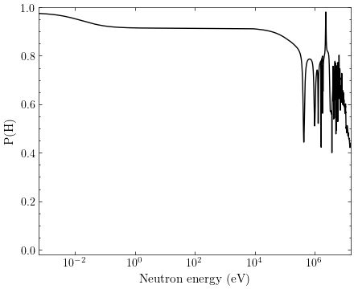{ width="400" }
  <figcaption><i>Figure 6: Probability of H collision as a function of neutron energy. </i></figcaption>
</figure>

Once the nuclide of interaction is determined, it is necessary to consider the reactions that can take place. Firstly we check absorbtion. The probability for absorbtion is given by:

\begin{equation} P(\text{absorbtion}) = \frac{\sigma_{i,a}}{\sigma_{i,tot}}, \end{equation}

where \( \sigma_{i, tot} \) and \( \sigma_{i, a} \) are the total and absorbtion cross section of the previously identified nuclide respectively. Again, if \(\xi < P(\text{absorbtion})\), then the neutron is absorbed by the nuclide. Absorption results in the complete dissipation of the neutron's energy and we proceed to simulate the next neutron. The absorption probability \(P(\text{absorbtion})\) as a function of neutron energy for H and O are shown in Figure 7 and 8 respectively.

<figure markdown="span">
  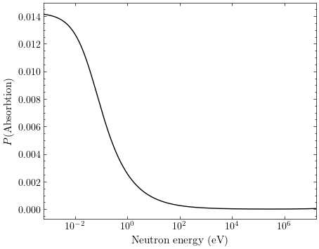{ width="400" }
  <figcaption><i>Figure 7: Absorbtion probability of H as a function of neutron energy.</i></figcaption>
</figure>

<figure markdown="span">
  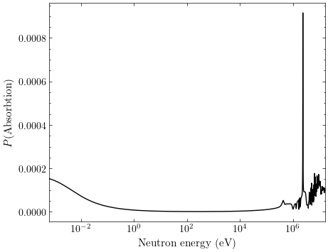{ width="400" }
  <figcaption><i>Figure 8: Absorbtion probability of O as a function of neutron energy.</i></figcaption>
</figure>

If the criteria mentioned above is not met, we consider a scattering interaction. This interaction leads to a reduction in the neutron's energy, determined by the outgoing angle. This angle is sampled from a distribution specific to the nuclide in question. The process of sampling the angle and computing the neutron's new direction and energy is elaborated upon in the Section [Handling Scattering Interaction](theory.md#25-handling-scattering-interaction).

### 2.5 Handling Scattering Interaction

A scattering interaction involving a neutron and nuclide results in an energy loss, which depends on the outgoing angle of the neutron. At lower (thermal) neutron energies, there is notable relative motion between the neutron and the nuclide. The treatment of this scenario is discussed in the Section [Thermal Motion](theory.md#26-thermal-motion). However, at higher energies, it is a reasonable approximation to consider the nuclides as stationary. We can extract the outgoing angles from datasets containing angular distributions sourced from [ENDF/B](https://www.nndc.bnl.gov/endf-b8.0/). These distributions, which vary with increasing neutron energies, are defined by Legendre polynomials and are provided in the center-of-mass frame. The representation of these angular distributions using Legendre polynomials is detailed in the [ENDF-6 Formats Manual](https://www.oecd-nea.org/dbdata/data/manual-endf/endf102.pdf), which we will briefly explain in [Angular Distributions](theory.md#251-angular-distributions). With this angle the new energy and direction of the neutron can be computed as described in [Transforming Coordinates](theory.md#252-transforming-coordinates).

#### 2.5.1 Angular Distributions

The angular distributions depend on the energy \(E\) in the labframe and the cosine of the outgoing angle in the center-of-mass frame \(\mu\). The distributions are normalized:

\begin{equation} \int^1_{-1} f(\mu, E) d\mu = 1. \end{equation}

We assume that the angular distributions of the scattered neutrons have azimuthal symmetry. This implies that we can uniformly select the azimuthal angle \(\phi\) from the range \( [0,2\pi) \). The distributions \( f(\mu, E) \) are represented as Legendre polynomials:

\begin{equation} f(\mu, E) =  \sum_{l=0}^{NL} \frac{2l+1}{2} a_l(E) P_l(\mu), \end{equation}

where \( l\) is the order of the Legendre polynomial, \(a_l \) the \(l^{th}\) Legendre polynomial coefficient, and \( NL \) the number of Legendre polynomials that represent the distribution. Below in Figure 9 and 10 the angular distributions are plotted for varying neutron energy.

<figure markdown="span">
  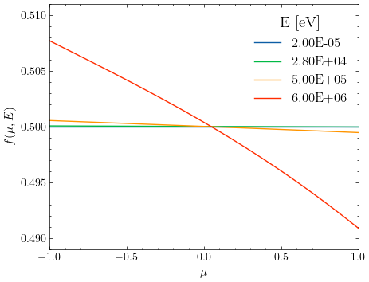{ width="400" }
  <figcaption><i>Figure 9: Hydrogen scattering angular distribution for varying energy.</i></figcaption>
</figure>

<figure markdown="span">
  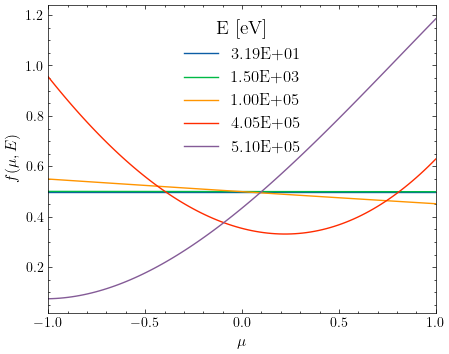{ width="400" }
  <figcaption><i>Figure 10: Oxygen scattering angular distribution for varying energy.</i></figcaption>
</figure>

EXPLANATION ABOVE FIGURES

The neutron energy distributions are discretely spaced for each incoming neutron energy \(E_i \), requiring a selection between the distribution corresponding to the energy immediately above or below the current neutron energy. This is done by defining an interpolation factor:

\begin{equation} f =  \frac{E - E_i}{E_{i+1} - E_i}, \end{equation}

where \( E \) is the incoming energy of the neutron. We designate \(k\) as the selected distribution index. If \( \xi > f \), then \(k=i\); otherwise, \(k=i+1\), where \( \xi \) is a uniform distributed random number on the interval \( [0, 1) \). The cosine of the scattering angle \(\mu \) in the center-of-mass (CM) frame is sampled from the angular distribution corresponding to \(E_k\).

#### 2.5.2 Transforming Coordinates

From the cosine of the scattering angle in the CM frame \(\mu \), the secondary velocity of the neutron can be calculated analytically. We start by considering the velocity of the center-of-mass which is given by:

\begin{equation} \mathbf{v}_{cm} = \frac{\mathbf{v}_n + A \mathbf{v}_t}{1+A} = \frac{\mathbf{v}_n}{1+A}, \end{equation}

where A is the mass of the target nuclide, \( \mathbf{v}_n \) the initial velocity of the neutron, and \( \mathbf{v}_t \) is the velocity of the target nuclide. For energies significantly surpassing thermal energy, \( \mathbf{v}_t \) can be considered negligble. The velocity of the neutron can now be transformed to the CM frame:

\begin{equation} \mathbf{V}_n = \mathbf{v}_n - \mathbf{v}_{cm}, \end{equation}

where the capital letter \( \mathbf{V} \) denotes the CM frame. If we express the post-collision direction in the CM frame as \( \mathbf{\Omega}' = (u', v', w') \), the components are given by:

\begin{equation}
\begin{aligned}  
    &u' = \sin{\theta} \cos{\phi} \\
    &v' = \sin{\theta} \sin{\phi} \\
    &w'= \cos{\theta}
\end{aligned}
\end{equation}

where \( \phi \) is the azimuthal angle and \( \theta = \cos^{-1}(\mu) \). We assume azimuthal symmetry, so \( \phi \) can be sampled from a random uniformly distributed interval \( [0, 2\pi) \). Finally, transforming back to the lab frame results in the new velocity of the neutron:

\begin{equation} \mathbf{v}'_n = ||\mathbf{V}_n|| \mathbf{\Omega}' + \mathbf{v}_{cm}. \end{equation}

The relation between the post- and pre-collision neutron energy in the labframe can be computed as

\begin{equation} E' = \frac{||\mathbf{v}'_n||^2}{||\mathbf{v}_n||^2} E, \end{equation}

and the relation between the old and new position is given by:

\begin{equation} \mathbf{r}'_n = \mathbf{r}_n + \frac{\mathbf{v}'_n}{||\mathbf{v}'_n||} l,\end{equation}

where \( l \) is obtained following the methodology outlined in [Distance to Next Collision](#23-distance-to-next-collision).

### 2.6 Thermal Motion

When the energy of the neutron approaches thermal energies, the target nuclide cannot be assumed to be at rest. The target nucleus will have motion associated with its thermal vibration. Thermal motion has an effect on the cross sections and the secondary angular distribution. In [The OpenMC Monte Carlo Code](https://docs.openmc.org/en/stable/index.html) a method is described for sampling the velocity of the target nucleus to be used in the elastic scattering kinematic equations described in [Handling Scattering Interaction](#25-handling-scattering-interaction). 

For the activation process we are mainly interested in the high energy neutrons. For simplicity in the simulation, thermal neutron energies are drawn from a Maxwell-Boltzmann distribution. Furthermore, the resulting direction of a neutron from a scattering reaction is chosen to be random. A neutron is considered thermal when it reaches an energy below the threshold of \( 10 K_B T \approx 0.252 \ eV\), where \( K_B \) is Boltzmann's constant and \(T \) is the temperature of the water. The Maxwell-Boltzmann distribution for \( T = 293 K \) is used in the simulation and shown in Figure 11.

<figure markdown="span">
  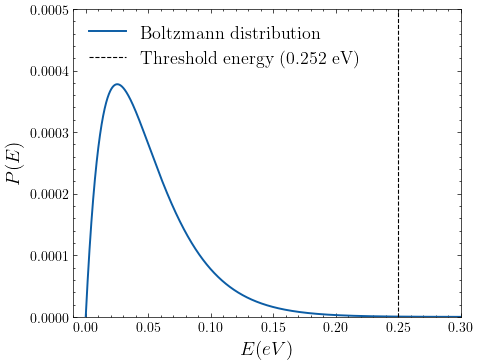{ width="400" }
  <figcaption><i>Figure 11: Maxwell-Boltzmann distribution of energies for T = 293 K. The thermal energy threshold used in the simulation is shown with the dashed line. </i></figcaption>
</figure>

## 3 Geometry

The geometry of the experiment is shown in Figure 12. In the simulation the neutron source is placed at the origin. The water tank of radius \( R\) and height \( h \) is placed at position \( \mathbf{r}_t\) such that the neutrons diffuse from the correct initial position. 

<figure markdown="span">
  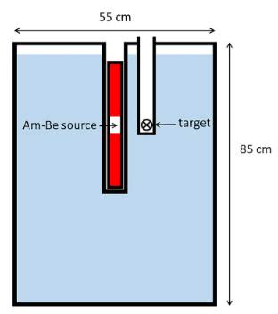{ width="250" }
  <figcaption><i>Figure 12: Simplified figure of the neutron source in the water tank. The insert containing the target can be moved in the radial direction through slots in the top plate of the water tank. </i></figcaption>
</figure>

A Neutron at position \( \mathbf{r}_n \) is inside the tank if the following conditions are true:

\begin{equation} 
\begin{aligned}
& |\mathbf{r}_n - \mathbf{r}_t |_{xy} < R  \\
& |r_{n_z} - r_{t_z} | < h/2,  \\
\end{aligned}
\end{equation}

where the notation \( | \mathbf{r} |_{xy} = \sqrt{r_x^2 + r_y^2} \) is used. If these conditions are not met, the neutron is flagged as escaped and the simulation proceeds with simulating the next neutron.

## 4 Monte Carlo Sampling

In the initilization the energies of the neutrons are sampled from the distribution shown in Figure 2. The secondary angles of the neutrons in a scattering interaction are sampled from angular distributions on the fly. Some examples of these angular distributions are shown in Figure 10. Finally, when a neutron reaches the thermal energy threshold, its energies are sampled from the Boltzmann distribution shown in Figure 11. The Monte Carlo method used in the simulation is rejection sampling. For simplicity, the proposal distribution is chosen to be a uniform distribution on the interval \([0, 1) \) for each of the sampling processes. The following steps are performed to sample a point from a PDF \(f\):

1. Sample y uniformly on the interval \([0, 1) \) and \( x\) between the bounds of the \( f \).
2. Compute \( P = f(x) \).
3. If \( y \leq P \) stop the process and return \(x\), else go back to step 1.

Figure 13 illustrates a large sample obtained from an angular distribution using rejection sampling. This figure is meant to demonstrate the sampling method, as in the simulation, only one secondary angle is sampled per elastic collision.

<figure markdown="span">
  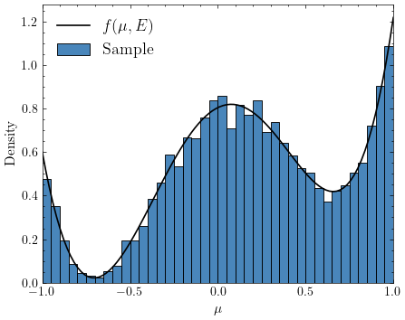{ width="350" }
  <figcaption><i>Figure 13: Sample of size N = 10000 obtained from the angular distribution of an elastic O-n collision at E = 5.48e6 eV using rejection sampling. </i></figcaption>
</figure>

## 5 Interpolation

## 6 Measuring Quantities

For neutron activation, we are interested in the flux and the energy spectrum of the neutrons at varying radius in the tank. These quantities can be computed from the positions of the neutrons and the energies of the neutrons at each collisions sight in the tank, which are stored after running the simulation.

### 6.1 Flux

### 6.2 Energy Spectrum