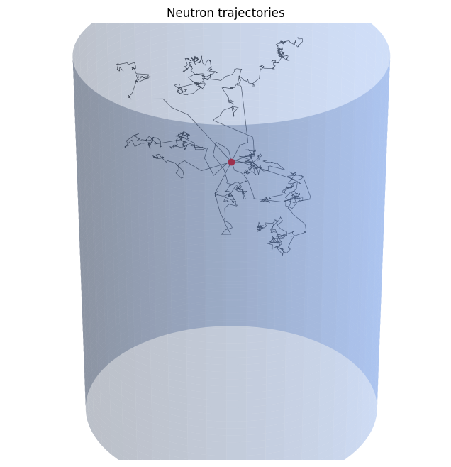

# User Guide

## 1. Quick Install Guide

NeutroWater requires Python >=3.10. You can install it from PyPI with `pip`:

```
pip install neutrowater
```

## 2. Example Usage

In this section an example is given of the usual workflow with NeutroWater. Below a simulation, is set-up and run for specific parameters and analyzed afterwards.


First import the `diffusing_neutrons` module:

```
from neutrowater import diffusing_neutrons as dn
```

Next, set up the simulation with specific parameters:

```
params = dn.Parameters(
            nNeutrons=10, 
            radius_tank=0.225, 
            height_tank=0.85, 
            position_tank=(0, 0, -0.175)
            )
neutrons = dn.DiffusingNeutrons(params)
```

Run the simulation for a specified number of collisions:

```
neutrons.diffuse(nCollisions=100000)
```

After the simulation has run, we can analyze the neutrons:

```
from neutrowater.post import measure, plot
```

First let's plot the trajectories:

```
plot.trajectories(neutrons)
```

<center>
<figure markdown="span">
  { width="300" }
</figure>
</center>

The `measure` module can be used to compute several quantities, such as the flux and energy spectrum at a specific distance $r = 0.1$ from the origin:

```
meas = measure.Measurer(neutrons)

fluxes = meas.flux(r = 0.1)
energies = meas.energy_spectrum(r = 0.1)
```

